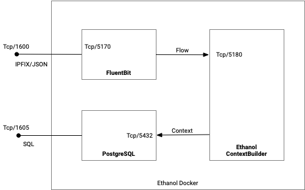

# Ethanol Deployment for Development

The Ethanol application leverages Docker to streamline its deployment, ensuring scalability and ease of management. This guide provides an overview of the application's deployment structure.

### Containers

* fluentbit-service: This container contains Fluent-Bit and is responsible for data ingestion.
* postgres-service: The PostgreSQL database where the application's data resides.
* ethanol-service: This container processes the incoming data and helps in building the context using implemented Ethanol.ContextBuilder application.

### Open access points

* fluentbit-service tcp/1600: Accepts Flowmon's JSON data. Once ingested, the records are directed to the Ethanol application for subsequent processing.

* postgres-service tcp/1605: Utilized for direct communication with the PostgreSQL database. This port allows you to:
  
  1. Populate the enrichment_data table, which the Ethanol application reads to gather supplementary information about hosts.
  2. Access the host_context table where the computed context information is stored.

### Volume Mappings

__fluentbit-service__ 

* ./log:/var/log: This maps the local log folder from the host machine to the /var/log directory inside the fluentbit-service container. This means that logs written to /var/log inside the container will actually be stored on the host machine inside the log directory.

* ./fluent-bit.conf:/fluent-bit/etc/fluent-bit.conf: This maps a local configuration file, fluent-bit.conf, to its respective configuration path inside the Fluent Bit container. This allows you to customize the behavior of Fluent Bit using your local configuration.

__postgres-service__

* ./data:/var/lib/postgresql/data: This maps the local data folder to the PostgreSQL data directory inside the postgres-service container. This ensures that the database files and any changes to them persist across container restarts.

* ./ethanol-db-init.sql:/docker-entrypoint-initdb.d/ethanol.sql: This maps a local SQL file, ethanol-db-init.sql, to the initialization scripts directory in the PostgreSQL container. This script will be executed when the container starts up for the first time. It contains comands to prepare the ethanol data abse and create required tables.

* ./netify:/var/netify: This maps the local netify folder to the /var/netify directory inside the postgres-service container. This can be used to insert and update the Netify dataset (see bellow the instruction on how to proceed).

### Processing pipeline

1. Data Ingestion: The application starts by reading the incoming data from Flowmon through Fluent-Bit's input endpoint.
2. Data Processing: The Ethanol application processes this raw data to extract context-specific information.
3. Storage: The refined and processed data is then stored in the host_context table inside the PostgreSQL container.



### Data Storage Scheme

The PostgreSQL database is created with the following tables:

Table `enrichment_data` is intended to store additional or supplementary information to enrich the context around computed IP host data: 

```sql
CREATE TABLE IF NOT EXISTS enrichment_data (
    type VARCHAR(32) NOT NULL,
    key VARCHAR(64) NOT NULL,
    value VARCHAR(128),
    reliability REAL,
    validity TSRANGE,
    details JSON
);
```

The meaning of the columns is as follows:

* `type` represents the kind or category of enrichment data.
* `key` serves as a unique identifier or key for the enrichment data. It might link the enrichment data with a host or flow.
* `value` stores the actual enrichment data corresponding to the key. For example, if the key is an IP address, the value could be its geolocation, domain name, device type, or other relevant information.
* `reliability` indicates the trustworthiness or confidence level of the enrichment data. It could be a score between 0 and 1, where 1 means highly reliable, and 0 means not reliable at all.
* `validity` indicates the time range when the enrichment data is considered valid or accurate. After this range, the data might be outdated or less reliable.
* `details` can store more detailed enrichment information in a structured JSON format. This can include nested data, arrays, or other details that don't fit neatly into the table's more rigid structure.

For the various examples of enrichment data see section bellow.

Table `host_context` is intended to store computed context related to IP hosts:

```sql
CREATE TABLE IF NOT EXISTS host_context (    
    key VARCHAR(255) NOT NULL,
    tags JSON,
    connections JSON,
    resolveddomains JSON,
    weburls JSON,
    tlshandshakes JSON,
    validity TSRANGE
);
```

* `key` represents the unique identifier for each IP host, which could be the IP address itself or another related unique value.
* `tags` can store a set of descriptive tags or labels associated with the IP host. These tags come from `enrichment_data` table.
* `connections` represents connections that the IP host has initiated or accepted. This includes destination IPs, ports, number of flows, packets, duration, and other relevant connection details.
* `resolveddomains` contains information about domain names that the IP host has resolved.
* `weburls` lists URLs with which the IP host might have accessed or interacted. It gives insights into the web activity of the host.
* `tlshandshakes` contains information about TLS (Transport Layer Security) handshakes initiated by the IP host. This provides insights into the secure communications of the host and can include details like cipher suites, certificates, or protocols.
* `validity` indicates the time range during which the host's context data is considered valid or accurate. 

## Deployment

Follow these steps to seamlessly deploy the Ethanol application using Docker:

1.__Set Up Your Working Directory:__ Navigate to the `Publish/Docker` directory in your project folder.

2.__Building the Application:__ Utilize Docker Compose to build the application from source:

```bash
docker-compose build
```

3.__Launching the Application:__ Execute the following command to initialize and run the services as described in your Docker Compose file:

```bash
docker-compose up
```

4.__Terminating the Application:__ If you wish to halt the running services, use the following command (ensure you're in the directory where you executed the `docker-compose up` command):

```bash
docker-compose down
```

5.__Environment Cleanup:__ To comprehensively stop and erase all containers initiated by `docker-compose up` and to discard the containers, networks, and volumes related to your services, deploy the command below:

```bash
docker-compose down --volumes --remove-orphans
```

## Usage

The deployed infrastructure is designed to efficiently process flow data and generate host-based context, providing valuable insights into network activity.
The system is accessible through two primary endpoints:

* tcp/1600, which accepts flow data in JSON format generated by the Flowmon exporter tool
* tcp/1605, the port on which the Postgres database listens for incoming requests

After the system is running, you can easily feed it with a continuous stream of netflow data in JSON format using the Flowmon exporter tool.

### Online mode: Export Netflows from flowmonexp5

The configuration for the IPFIX export using the Flowmon exporter is specified in the [probe-ethanol.json](probe-ethanol.json) configuration file.
This file should be uploaded to the `~/flowmonexp` folder on the Flowmon host. To generate IPFIX records in the required JSON format, run the following command on the Flowmon host:

```bash
sudo flowmonexp5 ~/flowmonexp/probe-ethanol.json | while(true); do nc --send-only IP-OF-DOCKER-HOST 1600; sleep 5; done
```

The exporter is set up to listen on the local monitoring interface, and it sends the IPFIX records to the standard output. These records are then consumed by netcat and forwarded to the ethanol context builder for further processing.

### Batch mode: Read flows from JSON file

The JSON file with exported IPFIX records can be sent to the ethanol by using nc tool by the followig command:

```bash
cat SOURCE-JSON-FILE | nc -q 0 IP-OF-DOCKER-HOST 1600
```

Note that `-q 0` option is required to end the connection after sending all data.

### Consume the context

The Ethanol application processes data and computes host contexts, storing the results in the host_context table within a PostgreSQL database. 
You can easily query this table to retrieve the stored data by following the steps below:

__Prerequisites:__ Ensure you have the PostgreSQL command-line tool, psql, installed on your machine.

__Establish Connection:__ Open a terminal or command prompt on your machine. Use the following command to connect to the PostgreSQL server:

```bash
psql -U postgres -W postgres -h IP-OF-DOCKER-HOST:1605 -d ethanol
```

Replace IP-OF-DOCKER-HOST with the actual IP address of the host machine where your Docker containers are running.

__Query the host_context Table:__ With an active connection to the PostgreSQL server:At the psql prompt, type the following SQL command to retrieve all the records from the host_context table:

```sql
SELECT * FROM host_context;
```

Review the returned data to understand the host context information stored by the Ethanol application.

## Enrichment Data

In the context of data enrichment, there are two distinct types: static enrichment data and dynamic enrichment data.

**Static enrichment** data refers to information that is known and available prior to the computation of the context.
This data is stored in the database and is not subject to frequent changes. It is relatively stable over time.
Even though it can change, such changes are rare. Examples are Netify data, Geolocation data.
Static data is used during the context computation process. It is incorporated as a part of the computed context from the outset. Dynamic Enrichment Data:

**Dynamic enrichment data** is generated in real-time and pertains to information that is often produced at the moment of context computation or may sometimes not be available at all during the computation. This data is fluid and changes frequently as it is derived from real-time operations. Unlike static data, dynamic data is not initially part of the computed context. It is added to the context later when the context is accessed or consumed, typically through an API.


The `enrichment_data` table is used to store and provide additional tags and attributes that enhances the informational value of hosts or flows, allowing for richer analysis.
One of the primary utilities of the `enrichment_data` table is to associate specific tags with hosts or flows. These tags can signify various attributes or characteristics.
Diverse data sources may represent information differently. The enrichment_data table brings a unified representation, ensuring consistency across different types of data.

The examples of different data are shown in the following table:

| type | key |value | reliability | validity | details |
| ---- | --- | ---- | ------------| ---------| --------|
| activity_bytes | 192.168.123.254 | 4560.0 | 1 | [2021-11-09 03:30:00,2021-11-09 03:40:00] | {"KeyType":"ip","KeyValue":"192.168.123.254","Source":"activity_bytes","StartTime":"2021-11-09T03:30:00","EndTime":"2021-11-09T03:40:00","Reliability":1,"Module":"ip_activity_new@netmonlab","Data":4560.0} |
| os_by_tcpip | 147.229.13.244 | "Linux" | 1 | [2021-11-09 03:41:07.289802,2021-11-09 03:46:26.679065] | {"KeyType":"ip","KeyValue":"147.229.13.244","Source":"os_by_tcpip","StartTime":"2021-11-09T03:41:07.289802","EndTime":"2021-11-09T03:46:26.679065","Reliability":1,"Module":"os_by_tcpip@collector-enta","Data":"Linux"} |

The enrichment_data table is versatile, storing diverse tag types, each identified uniquely by a key. This key could be represented in various formats, including but not limited to:

* IP Addresses
* Domain Names
* Flow Keys
* Other unique identifier values

For Netify data, there is a separate table which makes it easier and more efficient ot maintaain. The table names is `netify_data` and has the same structure 
as `enrichment_data` table but only contains data from the Netify data.

| type | key |value | reliability | validity | details |
| ---- | --- | ---- | ------------| ---------| --------|
| NetifyIp | 13.32.216.50 | app.netflix | 1 | [-infinity,infinity] | {"Tag":"app.netflix","ShortName":"Netflix","FullName":"Netflix","Category":"Streaming Media"} |
| NetifyDomain | microsoft | app.microsoft | 1 |  [-infinity,infinity] | {"Tag":"app.microsoft","ShortName":"Microsoft","FullName":"Microsoft","Category":"Business"} |

To populate the Netify data table, follow these step-by-step instructions:

1. **Prepare the Source CSV File**:
   
   - Locate the `prepare.py` script in the `netify` folder.
   - Run this script to prepare the source CSV. This will create `netify.csv` files that are ready to be loaded into the database.

2. **Load Data into the Database**:
   
   - Ensure the `netify` folder is correctly mounted to the PostgreSQL container at the `/var/netify` folder.
   - Open your command line interface.
   - Execute the following command to load the data into the database:

     ```bash
     psql -U postgres -d ethanol -f update-netify.sql
     ```

   This command uses PostgreSQL's command-line tool (`psql`) to run the `update-netify.sql` script. It connects to the database named `ethanol` as the `postgres` user and executes the SQL commands contained in the script. These commands will load the data from the prepared `netify.csv` into the Netify data table.